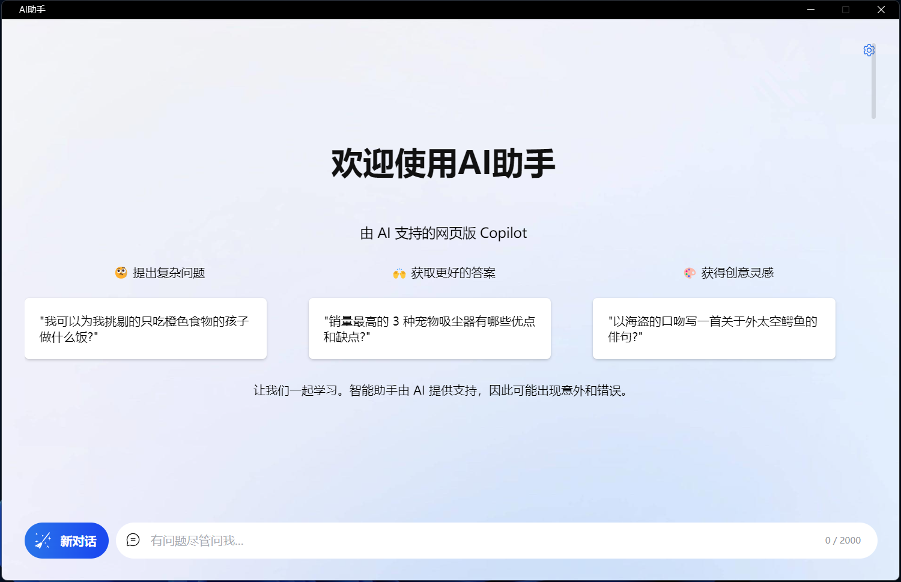

# AI Assistant for desktop

This is a simple app that makes ChatGPT live in your PC.

You can use Cmd+Shift+G (Mac) or Ctrl+Shift+G (Win) to quickly open it from anywhere.

Download:

- [Win .exe](https://github.com/diorlitao/ai-assistan/releases/download/0.0.9/ai-assistant.Setup.0.0.9.exe)

No system installation package currently offered. Clone the repo, npm install and run.

  

## Credit

All credit and copyrights goes to OpenAI.

## Author

You can find me on Twitter [@diorlitao](https://twitter.com/diorlitao).
